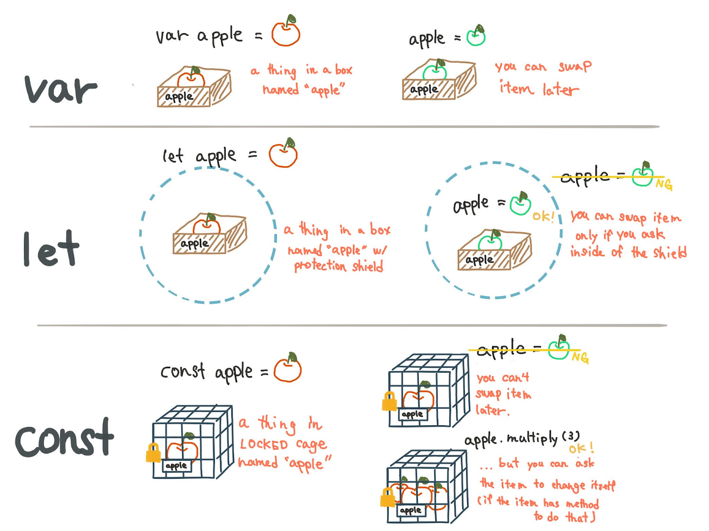

## Sobre o Javascript

[O Reino encantado do JavaScript – Hipsters #38](https://hipsters.tech/o-reino-encantado-do-javascript-hipsters-38/)

[Evolução e Especificação do JavaScript Moderno – Hipsters #58](https://hipsters.tech/evolucao-e-especificacao-do-javascript-moderno/)

## Como chamar o Js

```javascript
<script src="./js/script.js"></script>
```

----

## O que é DOM e para que serve

O Document Object Model ou simplesmente DOM é utilizado pelo navegador Web para representar a sua página Web. Quando altera-se esse modelo com o uso do Javascript altera-se também a página Web.

Um dos grandes responsáveis por isso tudo é o objeto “document que é responsável por conceder ao código Javascript todo o acesso a árvore DOM do navegador Web. 

Com o DOM pode-se mover itens dentro de uma página ou criar efeitos CSS bastante interessantes sem precisar nem mesmo recarregar a página.


- mudar todos os elementos HTML da página
- alterar todos os atributos HTML na página
- mudar todos os estilos CSS na página
- remover elementos e atributos HTML existentes
- adicionar novos elementos e atributos HTML
- reagir a todos os eventos HTML existentes na página
- criar novos eventos HTML na página

| Propriedade |	Descrição|
:--------- | :-------- |
documentElement | Captura o elemento raiz <html> de um documento HTML.
getElementById | Busca um elemento da página Web com o uso do atributo id do elemento.
querySelector | Busca um elemento da página Web com o uso do atributo id, classe ou tag do elemento.
createElement | Cria um nodo elemento na página.
createAttribute | Cria um nodo atributo na página.
createTextNode | Cria um nodo texto na página.
getElementsByTagName | Retorna um array dos elementos com o mesmo nome.
appendChild | Insere um novo elemento filho.
removeChild | Remove um elemento filho.
parentNode | Retorna o nodo pai de um nodo.


### Buscando elementos

```javascript
document.getElementById("nome-id")

document.querySelector(".classe")

document.querySelector("#id")

document.querySelector("div")

```


## Eventos no Javascript

Os eventos são basicamente um conjunto de ações que são realizadas em um determinado elemento da página web, seja ele um texto, uma imagem, ou uma div, por exemplo. Muitas das interações do usuário que está visitando sua página com o conteúdo do seu site podem ser consideradas eventos.

| Evento |	Descrição|
:--------- | :-------- |
onBlur | remove o foco do elemento
onChange | muda o valor do elemento
onClick | o elemento é clicado pelo usuário
onFocus | o elemento é focado
onKeyPress | o usuário pressiona uma tecla sobre o elemento
onLoad | carrega o elemento por completo
onMouseOver | define ação quando o usuário passa o mouse sobre o elemento
onMouseOut | define ação quando o usuário retira o mouse sobre o elemento
onSubmit | define ação ao enviar um formulário

Para chamar um evento externo iremos precisar de um manipulador de eventos, nesse caso vamos usar o event listener que adiciona ou remove um evento sobre qualquer elemento. O Event Listener disponibiliza duas funções principais, são elas:

- **addEvent** - Adiciona uma função que será disparada quando ocorrer determinado evento no objeto.
- **removeEvent** - Remove um listener previamente adicionado em um objeto e retorna true em caso de sucesso.

----

## Funções

Uma função é um procedimento JavaScript - um conjunto de instruções que executa uma tarefa ou calcula um valor,
ou seja, uma função é um bloco de código projetado para executar uma tarefa específica. Esse código é definido uma vez e chamado quantas vezes for necessário.

```javascript
function square(numero) {
    return numero * numero // não pulamos linha entre return e o que vai ser retornado
}

console.log(square(4)) //16
console.log(square(5)) //25
alert(square(9)) //81
```


## Eventos no Javascript - Click

```javascript
elemento.addEventListener("click", function(evento){
    //ação a ser executada no clique do elemento
    console.log(evento)
})
```

### preventDefault

O método `preventDefault()` cancela o evento se for cancelável, o que significa que a ação padrão que pertence ao evento não ocorrerá.

Por exemplo, isso pode ser útil quando:

- Clicando no botão "Enviar", evite que ele envie um formulário
- Ao clicar em um link, impeça o link de seguir o URL

Obs.: nem todos os eventos são canceláveis.


## Capturar valores de inputs em eventos
A propriedade value define ou retorna o valor do atributo value de um campo de texto.

A propriedade value contém o valor padrão OU o valor em que um usuário digita.

Retorne a propriedade value:
```javascript
input.value
```

Defina a propriedade value:
```javascript
input.value = texto
```

## Métodos do DOM para manipular CSS

O DOM HTML permite que o JavaScript mude o estilo dos elementos HTML.

Para alterar o estilo de um elemento HTML, use esta sintaxe:

```javascript
elemento.style.property = novo estilo
```

<!-- ## Manipulando elementos HTML

src -->

## Adicionar e remover classes do HTML pelo Javascript
O Element.classList é uma propriedade somente leitura que retorna uma coleção com as classes do elemento.


```javascript
elemento.classList
```

A propriedade classList é somente leitura, no entanto, você pode modificá-la usando os métodos add() e remove().

`contains()` Retorna um valor booleano, indicando se um elemento tem o nome da classe especificado. Valores possíveis:
- true - o elemento contém o nome da classe especificado
- false - o elemento não contém o nome da classe especificado

```javascript
elemento.classList.contains("classe")
```

`add()` Adiciona um ou mais nomes de classe a um elemento. Se a classe especificada já existir, a classe não será adicionada

```javascript
elemento.classList.add("classe");
```

`remove()` Remove um ou mais nomes de classe de um elemento. A remoção de uma classe que não existe, NÃO gera um erro

```javascript
elemento.classList.remove("classe");
```

## Eventos no Javascript - submit
O evento de envio é acionado quando o formulário é enviado, geralmente é usado para validar o formulário antes de enviá-lo ao servidor ou para interromper o envio e processá-lo em JavaScript.

O método form.submit() permite iniciar o envio de formulários a partir do JavaScript. Podemos usá-lo para criar e enviar dinamicamente nossos próprios formulários para o servidor.

## Validações com condicionais

`focus()`

O método focus() é usado para dar foco a um elemento (se ele puder ser focado).

```javascript
elemento.focus()
```
----



----
**Exercícios parte 1**

Acessando os nodulos/elementos e visualizando no console. Adicionando eventos de clique e acessando elementos a partir do evento Retornando uma resposta pro usário atraves de criaçao de elementos novos e recursos de alerta.

- botão clica e escreve no console
- botões clica e coloca cor no fundo

- input recebe email e agradece o recebimento
- input recebe telefone e agradece o recebimento
- input recebe nome e diz olá, nome

- Exercício tabela de gastos
----

**Exercícios parte 2**

Destacando um erro de formulário no focus e em eventos do teclado. Manipulando o estilo para fazer animações. Métodos de manipulação de atributo - classe Métodos de manipulação de atributo - imagem

- valida nome
- valida email
- valida telefone

- efeito menu
- efeito modal

----

**Exercícios para casa**

Exercício form de endereco

----

## Aprofundando em Js

[Trilha - Aprenda JavaScript da Melhor Maneira](http://programadorobjetivo.co/o-melhor-caminho-para-aprender-javascript-e-domina-lo/)
[Fundamentos JavaScript antes de aprender React](https://willianjusten.com.br/fundamentos-javascript-antes-de-aprender-react/)
[Valores verdadeiros e falsos em Js](https://www.sitepoint.com/javascript-truthy-falsy/) - Inglês
