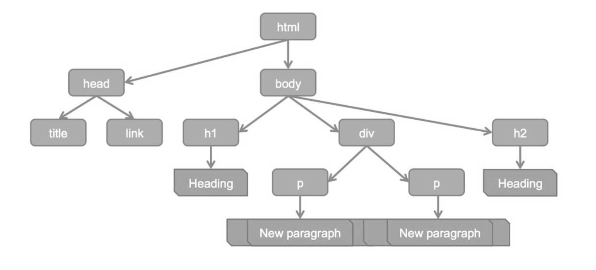

## Sobre o Javascript

[O Reino encantado do JavaScript – Hipsters #38](https://hipsters.tech/o-reino-encantado-do-javascript-hipsters-38/)

[Evolução e Especificação do JavaScript Moderno – Hipsters #58](https://hipsters.tech/evolucao-e-especificacao-do-javascript-moderno/)

## Como chamar o Js

```javascript
<script src="./js/script.js"></script>`
```
----

## Funções

Uma função é um procedimento JavaScript - um conjunto de instruções que executa uma tarefa ou calcula um valor,
ou seja, uma função é um bloco de código projetado para executar uma tarefa específica. Esse código é definido uma vez e chamado quantas vezes for necessário.

```javascript
function square(numero) {
    return numero * numero // não pulamos linha entre return e o que vai ser retornado
}

console.log(square(4)) //16
console.log(square(5)) //25
alert(square(9)) //81
```

----

## O que é DOM e para que serve

O Document Object Model ou simplesmente DOM é utilizado pelo navegador Web para representar a sua página Web. Quando altera-se esse modelo com o uso do Javascript altera-se também a página Web.

Um dos grandes responsáveis por isso tudo é o objeto “document que é responsável por conceder ao código Javascript todo o acesso a árvore DOM do navegador Web. 

Com o DOM pode-se mover itens dentro de uma página ou criar efeitos CSS bastante interessantes sem precisar nem mesmo recarregar a página.



- mudar todos os elementos HTML da página
- alterar todos os atributos HTML na página
- mudar todos os estilos CSS na página
- remover elementos e atributos HTML existentes
- adicionar novos elementos e atributos HTML
- reagir a todos os eventos HTML existentes na página
- criar novos eventos HTML na página

| Propriedade |	Descrição|
:--------- | :-------- |
documentElement | Captura o elemento raiz <html> de um documento HTML.
getElementById | Busca um elemento da página Web com o uso do atributo id do elemento.
querySelector | Busca um elemento da página Web com o uso do atributo id, classe ou tag do elemento.
createElement | Cria um nodo elemento na página.
createAttribute | Cria um nodo atributo na página.
createTextNode | Cria um nodo texto na página.
getElementsByTagName | Retorna um array dos elementos com o mesmo nome.
appendChild | Insere um novo elemento filho.
removeChild | Remove um elemento filho.
parentNode | Retorna o nodo pai de um nodo.


### Buscando elementos

```javascript
document.getElementById("nome-id")

document.querySelector(".classe")

document.querySelector("#id")

document.querySelector("div")

```


## Eventos no Javascript - Click 

### preventDefault


## Capturar valores de inputs em eventos

value


## Métodos do DOM para manipular CSS

style

## Manipulando elementos HTML

src

## Adicionar e remover classes do HTML pelo Javascript

classList
## Eventos no Javascript - submit

## Validações com condicionais

focus

----
**Exercícios parte 1**

Acessando os nodulos/elementos e visualizando no console. Adicionando eventos de clique e acessando elementos a partir do evento Retornando uma resposta pro usário atraves de criaçao de elementos novos e recursos de alerta.

- botão clica e escreve no console
- botões clica e coloca cor no fundo
- botões clica e coloca cor no fundo random + função random
- botões clica e coloca numero random (manipula 2 elemento) + função random


- input recebe email e agradece o recebimento
- input recebe telefone e agradece o recebimento
- input recebe nome e diz olá, nome

- Exercício tabela de gastos
----

**Exercícios parte 2**

Destacando um erro de formulário no focus e em eventos do teclado. Manipulando o estilo para fazer animações. Métodos de manipulação de atributo - classe Métodos de manipulação de atributo - imagem

- valida nome
- valida email
- valida telefone

- efeito menu
- efeito modal

----

**Exercícios para casa**

Exercício form de endereco

----

## Aprofundando em Js

[Trilha - Aprenda JavaScript da Melhor Maneira](http://programadorobjetivo.co/o-melhor-caminho-para-aprender-javascript-e-domina-lo/)
[Fundamentos JavaScript antes de aprender React](https://willianjusten.com.br/fundamentos-javascript-antes-de-aprender-react/)
[Valores verdadeiros e falsos em Js](https://www.sitepoint.com/javascript-truthy-falsy/) - Inglês
